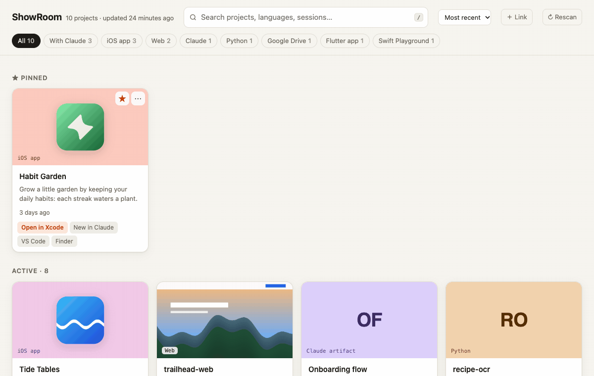

# ShowRoom

[](https://github.com/ccorrada/showroom/actions/workflows/test.yml)

**A local showcase of all your projects: a picture, a one-line description, and one click to get back to work.**

If you build a lot of things — apps, sites, scripts, design experiments, often with an AI assistant — they end up scattered
across folders and chats, and finding them again takes longer than it should. ShowRoom scans your project folders and
turns each one into a card. Click the card and you're back where you left off: the Claude app reopens your last
[Claude Code](https://docs.anthropic.com/en/docs/claude-code) session for that project, Xcode opens the project, or
VS Code opens the folder.

<picture>
  <source media="(prefers-color-scheme: dark)" srcset="docs/demo-dark.gif">
  
</picture>

<sub>Recorded from the built-in demo (`npm run demo`); all projects in it are fictional.</sub>

## Features

- **Finds your projects by itself.** Every folder inside your project roots becomes a card. It recognizes Xcode, Swift
  Playgrounds, Flutter, Android, web/Node, PHP, Python and document folders.
- **A picture for each card**, picked automatically: the app icon, a screenshot or banner in the repo, the first image
  of the README, a logo, or the first page of a PDF/Word/PowerPoint. Or paste your own (⌘V).
- **A short description**, taken from `README.md` / `CONTEXT.md` / `CLAUDE.md`, or written for you by Claude (optional).
- **One click back to work**: **reopen your latest Claude Code session** for that project — in the Claude desktop
  app (sessions started in a terminal are imported into the app) or in a new Terminal window — or open it in Xcode,
  VS Code or Android Studio, show it in Finder, or open the repository. Projects without a session get a
  "New in Claude" button that starts one in that folder.
- **Links to work that isn't on disk**: claude.ai chats, projects and artifacts, Google Docs/Sheets/Drive, Figma,
  GitHub… as their own cards or as extra buttons on a project.
- **Curation**: pin favorites, tag, hide, and move old projects to an archive (projects idle for 2+ years go there automatically).
- **Fast search** across names, descriptions, languages, tags and Claude session titles (press `/`).
- **Private by design**: everything runs on your Mac, on `127.0.0.1`. Nothing is uploaded anywhere — except the
  optional AI descriptions, which you trigger yourself (see [Privacy](#privacy)).
- **No dependencies**: plain Node.js plus tools that ship with macOS (`sips`, `qlmanage`, `launchd`).

## Requirements

- **macOS** (it uses `open`, Terminal, `sips`, `qlmanage` and `launchd`).
- **Node.js 20.12 or newer** (`brew install node`).
- Optional: the **Claude desktop app** and/or the **[Claude Code](https://docs.anthropic.com/en/docs/claude-code)**
  CLI (`claude`), signed in. Without them everything works except the Claude buttons and AI descriptions.

## Quick start

Install it (or update it) with one command:

```bash
curl -fsSL https://raw.githubusercontent.com/ccorrada/showroom/main/install.sh | bash
```

It checks for Node.js and git, clones ShowRoom into `~/.showroom/app`, sets it to start at login (a LaunchAgent,
`local.showroom`) and opens **http://localhost:4747** — bookmark it. You can read [install.sh](install.sh) first; it's short.

ShowRoom looks for common project folders (`~/Projects`, `~/Developer`, `~/Code`, `~/dev`, `~/src`, `~/repos`,
`~/GitHub`…). To choose your own, create `~/.showroom/config.json`:

```json
{ "roots": ["~/Projects"] }
```

then click **↻ Rescan**.

To uninstall: `node ~/.showroom/app/src/agent.mjs uninstall && rm -rf ~/.showroom/app` (add `rm -rf ~/.showroom` to
also delete your edits, links and images).

### Try it first, or install by hand

```bash
git clone https://github.com/ccorrada/showroom.git
cd showroom
npm run demo            # fictional projects → http://localhost:4848
npm start               # your projects → http://localhost:4747
npm run agent:install   # start at login
```

Other commands: `npm run agent:status`, `npm run agent:restart` (after updating the code) and `npm run agent:uninstall`.

## Configuration

`~/.showroom/config.json` (all fields optional):

```json
{
  "roots": ["~/Projects", "~/Developer/clients"],
  "port": 4747,
  "archiveAfterDays": 730,
  "claude": { "open": "app" },
  "describe": { "model": "haiku", "language": "English" }
}
```

| Setting | Meaning |
|---|---|
| `roots` | Folders whose **direct subfolders** are your projects. |
| `port` | Local port for the web page. |
| `archiveAfterDays` | Projects with no activity for longer go to the Archive section. |
| `claude.open` | Where Claude sessions open: `"app"` (the Claude desktop app, default when it's installed) or `"terminal"`. |
| `describe.model` | Claude model alias for AI descriptions. |
| `describe.language` | Language the AI descriptions are written in. |

Environment variables override the file: `SHOWROOM_ROOTS` (colon-separated), `SHOWROOM_PORT`, `SHOWROOM_HOME`
(where ShowRoom keeps its data, default `~/.showroom`), `SHOWROOM_CLAUDE_OPEN`, `SHOWROOM_CLAUDE_DIR` and
`SHOWROOM_CLAUDE_DESKTOP_DIR`.

### Per-project settings

Put a `.showroom.json` in a project folder to set its card from the repo itself:

```json
{ "description": "Offline-first notes app", "tags": ["client"], "pinned": true, "image": "docs/hero.png" }
```

Only `description`, `tags`, `pinned`, `hidden`, `archived`, `image` and `imageFit` (`"cover"` or `"icon"`) are read.

## Using it

- **Click a card** to run its main action. The smaller buttons are the other actions.
- **☆** pins a project. **⋯** edits it: description (or **✦ Write with AI**), tags, image (paste, drop or choose a
  file), links, archived and hidden.
- **＋ Link** adds a claude.ai chat/artifact, a Google Drive document or any URL — as its own card or as a button on a project.
- **↻ Rescan** picks up new projects right away; the server also rescans every hour.
- **AI descriptions in bulk**: `npm run describe` writes a one-line description for every project that has none.
  Each description is generated once and cached. `npm run describe -- my-app` redoes specific projects;
  `npm run describe -- --force` redoes all generated ones.
- **No server?** `npm run open` writes a static `~/.showroom/index.html`. Links still work; the other actions copy the
  command for you to paste in Terminal.

## Privacy

- Everything ShowRoom knows lives in `~/.showroom/` on your Mac: your edits (`curation.json`), links (`links.json`),
  AI descriptions (`ai-descriptions.json`), images and thumbnails.
- The server only listens on `127.0.0.1`.
- **AI descriptions** are the only feature that sends data out: when you run `npm run describe` or click
  **✦ Write with AI**, the project's file list, its manifest (e.g. `package.json`) and the first lines of a few source
  files are sent to Anthropic through your own Claude Code CLI. Files that look like secrets (`.env`, keys,
  credentials, databases) are never read. Claude runs with no tools and the session isn't saved.

## Security

ShowRoom can open apps on your Mac, so the local server is locked down:

- It listens on `127.0.0.1` only and rejects any unexpected `Host` header (blocks DNS rebinding).
- Every state-changing request needs a random token that changes on each start and is only embedded in the page it serves,
  plus a same-origin `Origin`.
- The browser only sends *which* project and *which* button; the command itself comes from the server's own scan and runs
  with `execFile` (no shell). Paths must be inside your configured roots.
- The page can't be framed by other sites (`X-Frame-Options`, CSP `frame-ancestors 'none'`).
- Links must be `http(s)`; uploaded images are checked by file signature; `.showroom.json` can only set a fixed list of fields.

Found a problem? Please open an issue (or a private security advisory on GitHub for anything sensitive).

## Development

```bash
npm test                # node --test, no dependencies (thumbnail tests need macOS)
npm run demo            # fictional projects on port 4848
npm run build           # one-off scan → ~/.showroom/catalog.json + index.html
node scripts/record-demo.mjs [light|dark]   # re-record the README GIF (demo running; needs Chrome + ffmpeg)
```

See [ARCHITECTURE.md](ARCHITECTURE.md) for how the pieces fit together.

## License

[MIT](LICENSE).

ShowRoom is an independent project. It is not affiliated with or endorsed by Anthropic; "Claude" and "Claude Code"
are referenced only to describe the integration.
